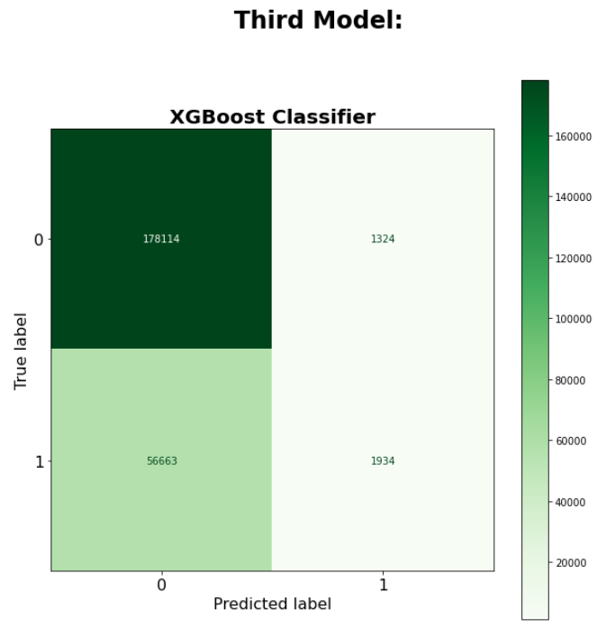

# Chicago Car Crash Project

**Authors**: [Michael Lee](mailto:baekho5767@gmail.com),
             [Doug Mill](mailto:thedougmill@gmail.com), and 
             [Carlos Mccrum](mailto:carlosmccrum@gmail.com)
 
## Overview

Our task is to build inferential classification models for the Vehicle Safety Board of Chicago. We cleaned and formatted our data provided by the City of Chicago containing crashes,  vehicles and people relating to crashes from 2016 to 2020, we then modeled the primary contributory causes of car accidents into two categories. We used an iterative modeling approach and incorporated several classification models to see if we could find what crashes were preventable. Our recommendations include investing in driver education for certain age groups and fixing certain road conditions that could cause a crash. 

## Business Understanding

Our stakeholder is the Vehicle Safety Board of Chicago. They are launching a new campaign to reduce car crashes. Our task is to build an inferential model to find out  which crashes were preventable and not. We labeled ‘Preventable’ as crashes that could have easily been avoided. Not following traffic laws and negligent driving would fall under this category. ‘Less Preventable’ are crashes that would require a substantial amount of money, time, and labor to fix. Bad road conditions, vision obscurity, and bad weather conditions would fall under this category.

## Data Understanding

The Vehicle Safety Board would like to better understand the causes of crashes in the Chicago area. That way, they can focus their campaign on potentially preventing some of those crashes in the future. We used data from the City of Chicago Data Portal, which contains information about Chicago Car Crashes from January 2016 to December 2020. The target variable was “primary contributory cause” as recorded by the police officer at the scene of the crash. Some of our inferential variables “defect road”, “bad road conditions”, and “obscured vision” will help us in our analysis to see if a crash was preventable. 

## Data Preparation

First we dropped all unnecessary columns such as injury severity and street direction. After dropping missing values we could not reasonably populate ourselves, we were left with a dataset of ~950,000 entries. Then, we mapped all the object data types into an int or float 64 to pass into our model. Finally, we created a Target column to label the crashes as Preventable or Less Preventable.

Most of our data preparation process can be found in our [Data Cleaning Notebook](/appendix/Data_Cleaning.ipynb) located in the appendix.

## Modeling

We modeled the data through iterative modeling. We used a logistic regression model as our first simple model. 


For our second model, we created a Decision Tree Classifier that scored slightly better than our simple model. We used a RFE to determine the most important features and iterated with GridSearch to find the best parameters. 


Lastly, we used a XGBoost classifier with GridSearchCV to find the best model.


## Regression Results

The results of our model indicated that most of the crashes were Preventable. By spending more money on drivers education in ages 20 - 39, we could curb the total accidents in Chicago drastically.

## Conclusions

We recommend investing in online drivers education because this could significantly lower the amount of preventable crashes in the Chicago area. We recommend driver education because it is affordable, easy to implement, and saves a lot more in labor costs vs. repairing all the roads in Chicago.

## For More Information

See the full analysis in the [Jupyter Notebook](./Final_edit_notebook.ipynb) or review this [Presentation](./KC_Real_Estate_Presentation.pdf).

For additional info contact [Michael Lee](mailto:baekho5767@gmail.com), [Carlos Mccrum](mailto:carlosmccrum@gmail.com), and [Doug Mill](mailto:thedougmill@gmail.com).

## Repository Structure

```
├── appendix
├── data
├── images
├── .gitignore
├── README.md
├── Chicago_Car_Crash_Notebook.ipynb
└── Chicago_Car_Crash_Presentation.pdf
